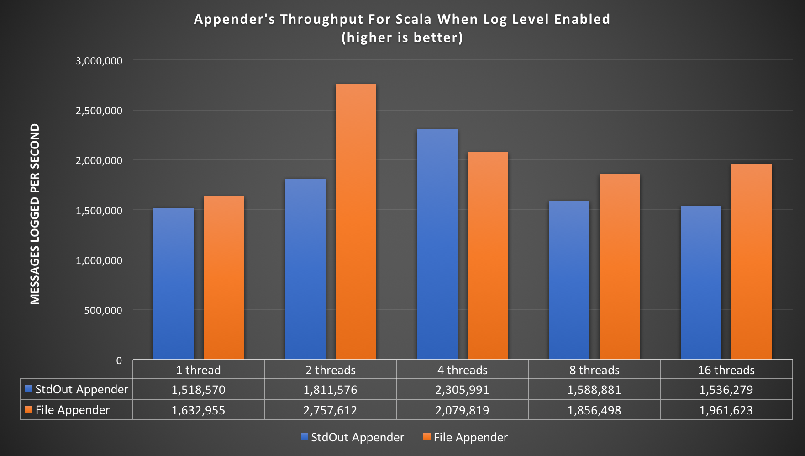
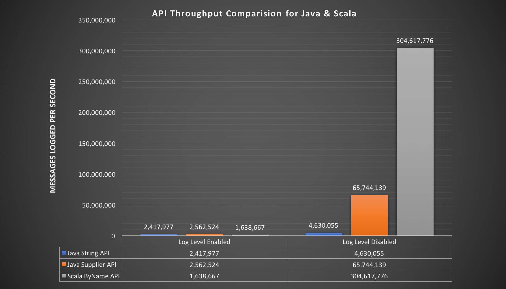

# Logging service

Logging Service library provides an advanced logging facility for csw components and services. 
    
## Artifacts

sbt
:   @@@vars
    ```scala
    libraryDependencies += "org.tmt" %% "csw-logging_$scala.binaryVersion$" % "$version$"
    ```
    @@@

maven
:   @@@vars
    ```xml
    <dependency>
     <groupId>org.tmt</groupId>
     <artifactId>csw-logging_$scala.binaryVersion$</artifactId>
     <version>$version$</version>
     <type>pom</type>
    </dependency>
    ```
    @@@

gradle
:   @@@vars
    ```gradle
    dependencies {
      compile group: "org.tmt", name: "csw-logging_$scala.binaryVersion$", version: "$version$"
    }
    ```
    @@@
    
    
## Configuration

These are the relevant default configuration values for logging

logging.conf
:   @@snip [logging.conf](../../../../csw-logging/src/main/resources/logging.conf)

These values can be overridden directly in the `reference.conf` or `application.conf`. Also `logLevel` for each component can be set
in reference.conf/application.conf as follows:

```
component-log-levels {
    tromboneHcd = debug
    tromboneAssembly = error
  }
  
```
@@@ note

Here `tromboneHcd` and `tromboneAssembly` is the name of component that will be registered with `LocationService`. By default
all components will log at level specified by `csw-logging.logLevel`. 

@@@

Library provides `StdOutAppender` as default logging appender. To use `FileAppender` or some custom appender along-with 
`StdOutAppender`, override `appenders` property to include multiple appender in csv format as follows:
 
```

appenders = ["csw.services.logging.appenders.FileAppender$", "csw.services.logging.appenders.StdOutAppender$"]

```

@@@ note

Make sure to provide full path of the appender since it will be spawned using java reflection. In csw code base, a working example of custom appender can be found at:
@github[Custom Appender](/csw-logging/src/test/scala/csw/services/logging/appenders/CustomAppenderTest.scala)

@@@

For `StdOutAppender` specify the format of log statements in `csw-logging.stdout` via `csw-logging.stdout.pretty` and `csw-logging.stdout.oneLine`.  

Turning `pretty` **on** or **off** will produce log statements in following format:

pretty=true
:   @@@vars
    ```
    {"@componentName":"my-component-name",
     "@severity":"INFO",
     "actor":
       "akka.tcp://csw-examples-locationServiceClient@10.131.124.238:51256/user/$a",
     "class":"csw.services.location.LocationServiceExampleClient",
     "exampleConnection":"LocationServiceExampleComponent-assembly-akka",
     "file":"LocationServiceExampleClientApp.scala",
     "line":131,
     "message":"Attempting to find connection",
     "obsId":"foo_obs_id",
     "timestamp":"2017-07-20T08:15:01.657Z"
    }
    ```
    @@@
      
pretty=false
:   @@@vars
    ```
    {"@componentName":"my-component-name","@severity":"INFO","actor":"akka.tcp://csw-examples-locationServiceClient@10.131.124.238:51172/user/$a","class":"csw.services.location.LocationServiceExampleClient","exampleConnection":"LocationServiceExampleComponent-assembly-akka","file":"LocationServiceExampleClientApp.scala","line":131,"message":"Attempting to find connection","obsId":"foo_obs_id","timestamp":"2017-07-20T08:03:08.065Z"}
    ```
    @@@
    

Similarly, turning `oneLine` on will produce log statements in following format:

oneLine=true
:   @@@vars
    ```
    [INFO] Attempting to find connection (LocationServiceExampleClientApp.scala 131)
    ```
    @@@
  
@@@ note

* If `oneLine` is set to `true` then value of `pretty` will be ignored

@@@

## Log Levels

Following Log levels are supported by csw-logging library

* FATAL
* ERROR
* WARN
* INFO
* DEBUG
* TRACE

Library allows separate log levels for the logging API(logLevel), Akka logging(akkaLogLevel), and Slf4J(slf4jLogLevel). The initial values of these are set in the configuration file as seen above. These can be overriden in the application.conf file.

These values can also be changed dynamically by calling methods on `LoggingSystem` class.

## Log Structure
All messages are logged by default as Json. Logs can contain following fields:

* `@componentName`: The name of the component if present
* `@host`: The local host name
* `@name`: The name of the application being run
* `@version`: The version of the application being run
* `@severity`: The message level: trace, debug, info, warn, error or fatal
* `actor`: The path for an actor when using ActorLogging
* `class`: The class for ClassLogging or ActorLogging
* `file`: The file containing the log call
* `kind`: Either slf4j or akka. Not present for logger API
* `line`: The line where the message was logged
* `message`: The log message
* `timestamp`: The UTC time when the message was logged
* `trace`: Information for any exception specified in the logging call


@@@ note

* `@host`, `@name` and `@version` will appear in log statements only if _fullHeaders_ is set as true in the configuration
* `file` and `line` will appear only in log statements from Scala classes/actors.  This is typical for Java logging tools, and is due to the lack of macro support in Java.       

@@@

## Create LoggingSystem

For logging statements to appear in the program, start `LoggingSystem` at an earliest location in an application.
**Also note, `LoggingSystem` should be started only once in an application.** The name used while creating `LoggingSystem` will be used to create
the folder and dump all logging files.

Scala
:   @@snip [LocationServiceExampleClientApp.scala](../../../../examples/src/main/scala/csw/services/location/LocationServiceExampleClientApp.scala) { #create-logging-system }

Java
:   @@snip [JLocationServiceExampleClientApp.scala](../../../../examples/src/main/java/csw/services/location/JLocationServiceExampleClient.java) { #create-logging-system }

@@@ note

* The `hostname` that is provided while creating `LoggingSystem` will appear in log statements against `@host` tag

@@@

## Stop LoggingSystem

Please ensure to stop `LoggingSystem` before application exits.

Scala
:   @@snip [LocationServiceExampleClientApp.scala](../../../../examples/src/main/scala/csw/services/location/LocationServiceExampleClientApp.scala) { #stop-logging-system }

Java
:   @@snip [JLocationServiceExampleClientApp.scala](../../../../examples/src/main/java/csw/services/location/JLocationServiceExampleClient.java) { #stop-logging-system }


## Enable logging

### Enable generic logging
To enable logging for some utility code that does not require `@componentName` in log statements, inherit from following traits:

Scala
:   * For actor class extend `GenericLogger.Actor`
    * For non-actor class extend `GenericLogger.Simple`

Java
:   * For actor class inherit `JGenericLoggerActor`
    * For non-actor class inherit `JGenericLogger`

### Enable component level logging
To include `@componentName` in your log statements, create an object/abstract class/interface as follows:

Scala
:   @@snip [ExampleLogger.scala](../../../../examples/src/main/scala/csw/services/commons/ExampleLogger.scala) { #component-logger }

Actor Java Class
:   @@snip [JExampleLogger.scala](../../../../examples/src/main/java/csw/services/commons/JExampleLoggerActor.java) { #jcomponent-logger-actor }

Non-Actor Java class
:   @@snip [JExampleLogger.scala](../../../../examples/src/main/java/csw/services/commons/JExampleLogger.java) { #jcomponent-logger }


Then, inherit following object/interface:

Scala
:   * For actor class extend `ExampleLogger.Actor`
    * For non-actor class extend `ExampleLogger.Simple`
    
Java
:   * For actor class inherit `JExampleLoggerActor`
    * For non-actor class inherit `JExampleLogger`


@@@ note { title="Example to mixin above loggers in actors "}

Scala
:   @@snip [JLocationServiceExampleClient](../../../../examples/src/main/scala/csw/services/location/LocationServiceExampleClientApp.scala) { #actor-mixin }

Java
:   @@snip [JLocationServiceExampleClient](../../../../examples/src/main/java/csw/services/location/JLocationServiceExampleClient.java) { #actor-mixin }

Loggers for classes can be mixed in a similar way  

@@@


## Log statements

Logging statements are used very much like existing logging services such as log4j.  For Java, there is an additional way of writing log messages using Supplier methods (lambdas).  The use of lambdas is more efficient since the computations in a message (e.g. string concatenation) are not performed unless the message is actually being logged.  Therefore, these supplier methods should be used in cases where high performance is required (see [performance results below](#java-logging-string-vs-supplier-api-performance)).

A basic info statement can be written as follows:

Scala
:   @@snip [LocationServiceExampleClientApp.scala](../../../../examples/src/main/scala/csw/services/location/LocationServiceExampleClientApp.scala) { #log-info }

Java
:   @@snip [JLocationServiceExampleClient.scala](../../../../examples/src/main/java/csw/services/location/JLocationServiceExampleClient.java) { #log-info }

Java (Supplier)
:   @@snip [JLocationServiceExampleClient.scala](../../../../examples/src/main/java/csw/services/location/JLocationServiceExampleClient.java) { #log-info-supplier }

The output of log statement will be:

Scala
:   @@@vars
    ```
{"@componentName":"my-component-name",
 "@severity":"INFO",
 "actor":
   "akka.tcp://csw-examples-locationServiceClient@131.215.210.170:55532/user/$a",
 "class":"csw.services.location.LocationServiceExampleClient",
 "file":"LocationServiceExampleClientApp.scala",
 "line":116,
 "message":"Result of the find call: None",
 "timestamp":"2017-07-26T19:39:59.764Z"
}
    ```
    @@@

Java
:   @@@vars
    ```
{"@componentName":"my-component-name",
 "@severity":"INFO",
 "actor":
   "akka.tcp://csw-examples-locationServiceClient@131.215.210.170:55556/user/LocationServiceExampleClient",
 "class":"csw.services.location.JLocationServiceExampleClient",
 "message":
   "Find result: LocationServiceExampleComponent-assembly-akka, component type=Assembly, connection type=AkkaType",
 "timestamp":"2017-07-26T19:44:58.623Z"
}
    ```
    @@@

Java (Supplier)
:   @@@vars
    ```
{"@componentName":"my-component-name",
 "@severity":"INFO",
 "actor":
   "akka.tcp://csw-examples-locationServiceClient@131.215.210.170:55556/user/LocationServiceExampleClient",
 "class":"csw.services.location.JLocationServiceExampleClient",
 "message":
   "Resolve result: LocationServiceExampleComponent-assembly-akka, component type=Assembly, connection type=AkkaType",
 "timestamp":"2017-07-26T19:44:58.636Z"
}
    ```
    @@@

Library allows usage of `Map` in message as follows:

Scala
 :   @@snip [LocationServiceExampleClientApp.scala](../../../../examples/src/main/scala/csw/services/location/LocationServiceExampleClientApp.scala) { #log-info-map }
 
Java
 :   @@snip [JLocationServiceExampleClient.scala](../../../../examples/src/main/java/csw/services/location/JLocationServiceExampleClient.java) { #log-info-map }

Java (Supplier)
 :   @@snip [JLocationServiceExampleClient.scala](../../../../examples/src/main/java/csw/services/location/JLocationServiceExampleClient.java) { #log-info-map-supplier }

The output of log statement will be: 

Scala
:   @@@vars
    ```
{"@componentName":"my-component-name",
 "@severity":"INFO",
 "actor":
   "akka.tcp://csw-examples-locationServiceClient@131.215.210.170:55532/user/$a",
 "class":"csw.services.location.LocationServiceExampleClient",
 "exampleConnection":"LocationServiceExampleComponent-assembly-akka",
 "file":"LocationServiceExampleClientApp.scala",
 "line":110,
 "message":
   "Attempting to find AkkaConnection(ComponentId(LocationServiceExampleComponent,Assembly))",
 "obsId":"foo_obs_id",
 "timestamp":"2017-07-26T19:39:59.756Z"
}
    ```
    @@@
    
Java
:   @@@vars
    ```
{"@componentName":"my-component-name",
 "@severity":"INFO",
 "actor":
   "akka.tcp://csw-examples-locationServiceClient@131.215.210.170:55556/user/LocationServiceExampleClient",
 "class":"csw.services.location.JLocationServiceExampleClient",
 "exampleConnection":"LocationServiceExampleComponent-assembly-akka",
 "message":
   "Attempting to find AkkaConnection(ComponentId(LocationServiceExampleComponent,Assembly))",
 "obsId":"foo_obs_id",
 "timestamp":"2017-07-26T19:44:58.575Z"
}
    ```
    @@@

Java (Supplier)
:   @@@vars
    ```
{"@componentName":"my-component-name",
 "@severity":"INFO",
 "actor":
   "akka.tcp://csw-examples-locationServiceClient@131.215.210.170:55556/user/LocationServiceExampleClient",
 "class":"csw.services.location.JLocationServiceExampleClient",
 "exampleConnection":"LocationServiceExampleComponent-assembly-akka",
 "message":
   "Attempting to resolve AkkaConnection(ComponentId(LocationServiceExampleComponent,Assembly)) with a wait of 30 seconds...",
 "obsId":"foo_obs_id",
 "timestamp":"2017-07-26T19:44:58.628Z"
}
    ```
    @@@

    
Library allows to log an error with it's full stacktrace as follows:
 
Scala
  :   @@snip [LocationServiceExampleClientApp.scala](../../../../examples/src/main/scala/csw/services/location/LocationServiceExampleClientApp.scala) { #log-error }
 
Java
 :   @@snip [JLocationServiceExampleClient.scala](../../../../examples/src/main/java/csw/services/location/JLocationServiceExampleClient.java) { #log-info-error }
 
Java (Supplier)
 :   @@snip [JLocationServiceExampleClient.scala](../../../../examples/src/main/java/csw/services/location/JLocationServiceExampleClient.java) { #log-info-error-supplier }
 
 
## Source code for examples

* @github[Scala Example](/examples/src/main/scala/csw/services/location/LocationServiceExampleClientApp.scala)
* @github[Java Example](/examples/src/main/java/csw/services/location/JLocationServiceExampleClient.java)
  

## Performance
Performance results documented on this page is measured in terms of Throughput and obtained with the JMH Java benchmark harness. 
Sourcecode for all the JMH benchmarks can be found here at [CSW Benchmarks](https://github.com/tmtsoftware/csw-prod/tree/master/csw-benchmark/src/main) 

[Wikipedia](https://en.wikipedia.org/wiki/Throughput) definition of Throughput is the maximum rate of production or the maximum rate at which something can be processed. 
In our case, throughput is defined as how many messages can be logged in a certain period of time.

### Test Machine Configuration :

* MacBook Pro (Retina, 15-inch, Mid 2015)
* Processor Name:       Intel Core i7
* Processor Speed:      2.8 GHz
* No. of Processors:    1
* No. of Cores:         4
* L2 Cache (per Core):  256 KB
* L3 Cache:             6 MB
* Memory:               16 GB 1600 MHz DDR3
* JDK:                  1.8.0_121


### Scala Logging : Appender's Throughput



Above graph includes the throughput results for File and StdOut appender's using scala's logging API. Java's logging API throughput results are included further down this page.  
As shown in the above graph, experiment was carried out for 1, 2, 4, 8 and 16 threads. That means, multiple threads are logging messages concurrently. 

@@@ note

* Numbers indicated in the graph does not mean that those number of messages are actually written to file or console. These are the number of logging messages sent to LogActor asynchronously for the period of one second.
* It is the responsibility of LogActor to write these messages to file or console.
* LogActor uses BoundedMailbox with a mailbox-capacity = 262144, messages are dropped if mailbox gets full.

@@@


### Scala And Java Logging : Throughput Comparision (Log Level Enabled vs Disabled)
Below graph depicts the throughput of Java's logging API (String and Supplier) and scala's logging API when log level was enabled and disabled. 

@@@ note

* **Log Level Enabled**  : Results are obtained for `log.info` when default log level was set to info, that means the logging messages were sent to LogActor for writing it to file.
* **Log Level Disabled** : Results are obtained for `log.trace` when default log level was set to info, that means the logging messages were not written to file.

@@@



This graph is produced based on the result generated by [JE2ELoggingBenchmark](https://github.com/tmtsoftware/csw-prod/blob/master/csw-benchmark/src/main/java/csw/services/logging/perf/jmh/JE2ELoggingBenchmark.java) and 
[E2ELoggingBenchmark](https://github.com/tmtsoftware/csw-prod/blob/master/csw-benchmark/src/main/scala/csw/services/logging/perf/jmh/E2ELoggingBenchmark.scala)

@@@ note

* As you can see in the above graph, Supplier version of Java log API and by name of scala API is very efficient and throughput is much higher than String version. It is recommended to use Supplier API by java developers.

@@@

## Acknowledgement
The codebase in **csw-logging** module is based on [persist-logging](https://github.com/nestorpersist/logging) library. We appreciate efforts put in by authors of the persist-logging library which made our development fast and easy.
   
  


